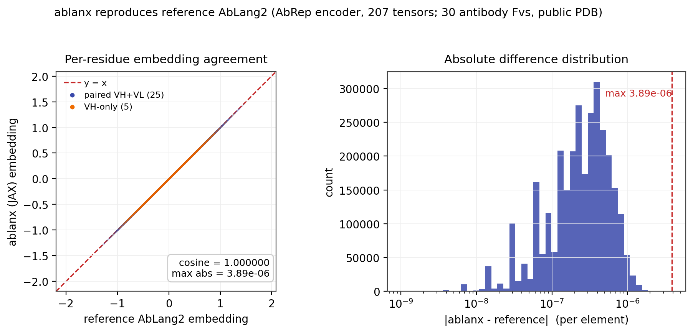

# ablanx

ablanx is a faithful JAX/Flax port of the AbLang2 AbRep encoder. It loads the original AbLang2
weights unchanged and returns per-residue embeddings and per-block attention in a single JAX forward
pass, so an antibody sequence prior can sit inside a larger JAX/Flax model.

AbLang2 is the work of the Oxford Protein Informatics Group (OPIG); this repository is a port, not a
new model. Provenance and citation are in [ATTRIBUTION.md](ATTRIBUTION.md) and
[CITATION.cff](CITATION.cff).

## Why use it

- Drop-in AbLang2 embeddings inside JAX/Flax workflows.
- No PyTorch dependency at inference (weights load from a plain npz).
- Pure JAX forward: `jit` / `vmap` / `grad`-compatible and composable in a larger model.
- Per-block attention returned directly from the same call.
- Numerically verified against the reference implementation (max abs 3.9e-6 across a 30-Fv panel).

## Quickstart

Install:

    pip install ablanx
    # from source: pip install git+https://github.com/fabricagen/ablanx
    # imports as `ablang_jax`.

Embeddings:

    import numpy as np, jax.numpy as jnp
    from ablang_jax import Ablanx, load_ablanx_params

    model = Ablanx()
    params = {"params": load_ablanx_params(dict(np.load("ablang2_weights.npz")))}  # AbRep weights
    tokens = jnp.array([[...]], dtype=jnp.int32)         # AbLang2 token ids, shape [B, L]
    mask = jnp.ones_like(tokens, dtype=jnp.float32)      # 1 = keep, 0 = pad
    hidden, attentions = model.apply(params, tokens, mask, return_attn=True)
    # hidden:     [B, L, 480]         per-residue embeddings
    # attentions: [12, B, 20, L, L]   per-block attention maps

See [Weights](#weights) for the npz.

## What it is

AbLang2 is an antibody-specific protein language model. Its encoder (AbRep) is a 12-block pre-norm
transformer: hidden 480, 20 heads, SwiGLU feed-forward, rotary position embeddings, vocab 26,
trained on paired antibody sequences. `ablanx` re-expresses AbRep in Flax so the original
BSD-3-Clause weights load without change, returning per-residue hidden states and per-block attention
maps in one forward pass.

## Differentiability

The forward is a pure JAX function, so it composes inside a larger model and runs under `jit`,
`vmap`, and `grad`. Useful gradients flow with respect to:

- the model parameters (`params`), and
- any continuous input substituted for the token lookup, for example a soft or one-hot embedding
  passed in place of integer ids.

The public interface takes integer `tokens`, which are discrete and do not themselves admit
gradients; to optimize a sequence through the encoder, feed a continuous representation rather than
token ids. In the seam folder, ablanx runs frozen as a fixed sequence prior.

## What works today

- The Flax AbRep encoder, `ablang_jax.model.Ablanx`.
- The PyTorch-to-Flax weight key mapping, `ablang_jax.model.load_ablanx_params`, which maps an
  AbLang2 AbRep `state_dict` (as numpy arrays) into the Flax parameter tree.
- A weight exporter, `export_weights.py`, that writes the AbRep weight npz from the reference model.
- A precompute script, `ablang_jax.precompute`, that runs the reference PyTorch AbLang2 over a set of
  antibody records and stores per-residue embeddings.

## Validation

The JAX forward reproduces reference PyTorch AbLang2 to float32 precision. Across a 30-Fv panel (25
paired VH+VL and 5 VH-only, drawn from public PDB structures), per-residue embeddings match the
reference with maximum absolute difference 3.9e-6 (median 2.4e-6 per Fv) and cosine above 0.999999,
using the same weights. The weights are byte-identical to the reference AbRep state_dict (207 tensors,
exact match). Reproduce with `test_agreement.py`.

## Weights

The weights are the original AbLang2 AbRep weights, unmodified (207 tensors).

- Export from the reference model (works today, no release needed):
  `pip install ablang2 torch && python export_weights.py` writes `ablang2_weights.npz`, verified
  byte-identical to the reference.
- A torch-free `ablang2_weights.npz` is also attached to the GitHub release once one is tagged.

Point `ABLANG_WEIGHTS` at the npz, or pass `dict(np.load(...))` to `load_ablanx_params`.

## Not included

- Only the AbRep encoder (embeddings and attention) is ported. The amino-acid likelihood head used
  for the pseudo-log-likelihood (sequence naturalness) is not part of this encoder port; use the
  reference AbLang2 for likelihoods.

## Precompute

Precompute embeddings for a set of records with the reference PyTorch `ablang2`:

    export ABLANG_JAX_DATA=/path/to/records
    python -m ablang_jax.precompute --data $ABLANG_JAX_DATA

Input records are npz shards named `{train,test}_*.npz`; see `ablang_jax/precompute.py` for the
expected per-record fields. Outputs default to `./out/` when paths are not set.

## Tests

    python test_shapes.py                                          # forward, weight-key mapping, masking
    ABLANG_WEIGHTS=ablang2_weights.npz python test_agreement.py    # agreement vs reference (needs weights)

`test_shapes.py` needs no weights. `test_agreement.py` loads the committed golden panel
(`golden_ablang2_panel.npz`, reference embeddings for 30 Fvs) and checks the JAX forward matches every
one; it skips under pytest if `ABLANG_WEIGHTS` is unset.

## Attribution

- Original model, training, and weights: AbLang2, Oxford Protein Informatics Group.
  https://github.com/oxpig/AbLang2 (BSD-3-Clause, Copyright (c) 2021, Tobias Hegelund Olsen).
- Paper: Olsen, Moal, Deane, "Addressing the antibody germline bias and its effect on language models
  for improved antibody design", bioRxiv 2024, doi:10.1101/2024.02.02.578678.
- This port: Fabricagen.

ablanx is the language-model component of the **seam** bundle, a JAX antibody Fv structure predictor
that couples jaxfvld with ablanx. For antibody developability screening and repair, see **sift**:
https://sift.fabricagen.ai (coming soon, ca 08/26)

## License

BSD-3-Clause. This port preserves the original AbLang2 copyright (Copyright (c) 2021, Tobias Hegelund
Olsen) and adds Copyright (c) 2026, Fabricagen for the port. The upstream AbLang2 license was
confirmed BSD-3-Clause. See `ATTRIBUTION.md`.
