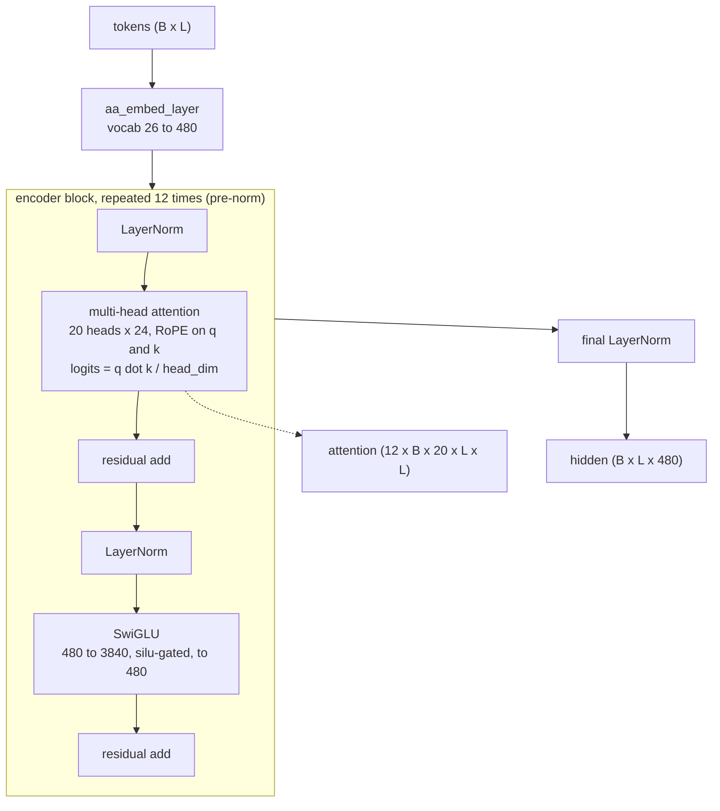
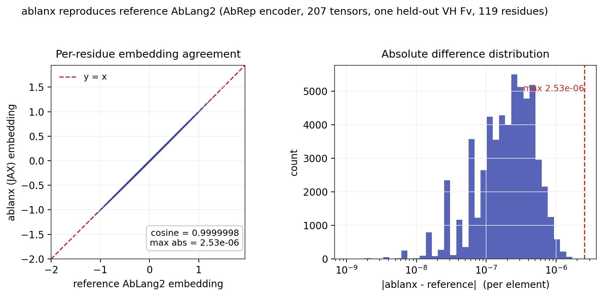

# ablanx: Technical Brief

A JAX/Flax port of AbLang2's AbRep encoder (Oxford OPIG). The architecture is re-expressed in Flax so the
original BSD-3-Clause PyTorch weights load unchanged, giving per-residue embeddings and per-block attention in
one differentiable JAX forward pass. Intended for antibody sequence priors that must sit inside a larger JAX
model (for example the seam folder).

Status: the encoder is implemented and validated against reference PyTorch AbLang2 (per-residue embeddings
match to maximum absolute difference 2.5e-6 and cosine 1.000000 on the same weights). The weights are the
original AbRep weights, unmodified. The amino-acid likelihood head (pseudo-log-likelihood) is not part of
this encoder port.

This is a port. The AbLang2 architecture, training, and weights are the work of the AbLang2 authors (OPIG).

---

## 1. AbRep encoder



| Property | Value |
|---|---|
| Blocks | 12, pre-norm transformer |
| Hidden | 480 |
| Heads | 20, head dim 24 |
| Attention scale | net 1 / head_dim (AbLang2 scales q by head_dim^-0.5 and divides by sqrt(head_dim)) |
| Positions | rotary (RoPE), interleaved convention (rotary_embedding_torch) |
| Feed-forward | SwiGLU: 480 to 3840, split into value and gate, silu(gate) times value, to 480 |
| Vocab | 26 |
| LayerNorm eps | 1e-12 |
| Final head | LayerNorm after all blocks, returned as the last hidden states |

---

## 2. The port

The Flax module reproduces AbLang2's AbRep so a PyTorch `state_dict` maps in directly.

| PyTorch (AbLang2 AbRep) | Flax (ablanx) | Transform |
|---|---|---|
| `aa_embed_layer.weight` | `aa_embed_layer.embedding` | copy |
| `...q_proj/k_proj/v_proj/out_proj.weight` | `q_proj/k_proj/v_proj/out_proj.kernel` | transpose (Linear [out,in] to Dense [in,out]) |
| `...intermediate_layer.0.weight` | `ffn_in.kernel` | transpose |
| `...intermediate_layer.2.weight` | `ffn_out.kernel` | transpose |
| `...pre_attn_layer_norm / final_layer_norm.weight` | `...LayerNorm.scale` | copy |
| `layer_norm_after_encoder_blocks.weight` | `layer_norm_after_encoder_blocks.scale` | copy |

`load_ablanx_params` performs the full key mapping. Linear biases and LayerNorm biases copy unchanged.

---

## 3. What is ported

| Component | State |
|---|---|
| AbRep encoder (`Ablanx`) | implemented |
| Weight key mapping (`load_ablanx_params`) | implemented |
| Reference PyTorch precompute (`precompute.py`) | implemented |
| Weight exporter (`export_weights.py`) | implemented |
| Weights | original AbRep weights, unmodified (export or release) |
| Agreement vs reference PyTorch | max abs 2.5e-6, cosine 1.000000 (`test_agreement.py`) |
| Amino-acid likelihood head (pseudo-log-likelihood) | not ported; use reference AbLang2 for likelihoods |



---

## 4. API

One differentiable call returns both hidden states and per-block attention, which is the point of the port: an
antibody sequence prior that composes inside a JAX model.

```python
import jax.numpy as jnp
from ablang_jax import Ablanx, load_ablanx_params

model = Ablanx()
params = {"params": load_ablanx_params(state_dict)}   # AbLang2 AbRep weights as numpy arrays
tokens = jnp.array([[...]], dtype=jnp.int32)           # AbLang2 token ids, [B, L]
mask = jnp.ones_like(tokens, dtype=jnp.float32)        # 1 keep, 0 pad
hidden, attentions = model.apply(params, tokens, mask, return_attn=True)
# hidden:     [B, L, 480]
# attentions: [12, B, 20, L, L]
```

In seam these become `seq_emb` (the folder's single representation) and `ab_attn` (the folder's pair
representation), run frozen with the attention detached.

---

## 5. vs the original AbLang2

| | AbLang2 (OPIG) | ablanx |
|---|---|---|
| Framework | PyTorch | JAX / Flax |
| Architecture | AbRep encoder + AA likelihood head | AbRep encoder only |
| Weights | original | same weights, loaded unchanged |
| Attention maps | per call | returned per block in the same call |
| Composability | standalone | differentiable inside a larger JAX model |
| Likelihood / naturalness | yes | not ported (use reference AbLang2) |

Same architecture and weights; the port adds a JAX forward that hands back embeddings and attention together
for use as a prior.

## 6. Scope and caveats

- Encoder only; the likelihood head is not in this port (use reference AbLang2 for likelihoods).
- The weights are the original AbLang2 AbRep weights; this port does not retrain or modify them.

## Attribution

- Model, training, weights: AbLang2, Oxford Protein Informatics Group. https://github.com/oxpig/AbLang2
  (BSD-3-Clause, Copyright 2021 Tobias Hegelund Olsen).
- Paper: Olsen, Moal, Deane, "Addressing the antibody germline bias and its effect on language models for
  improved antibody design", bioRxiv 2024, doi:10.1101/2024.02.02.578678.
- Port: Fabricagen. BSD-3-Clause; see `ATTRIBUTION.md`, `CITATION.cff`, and `LICENSE`.
